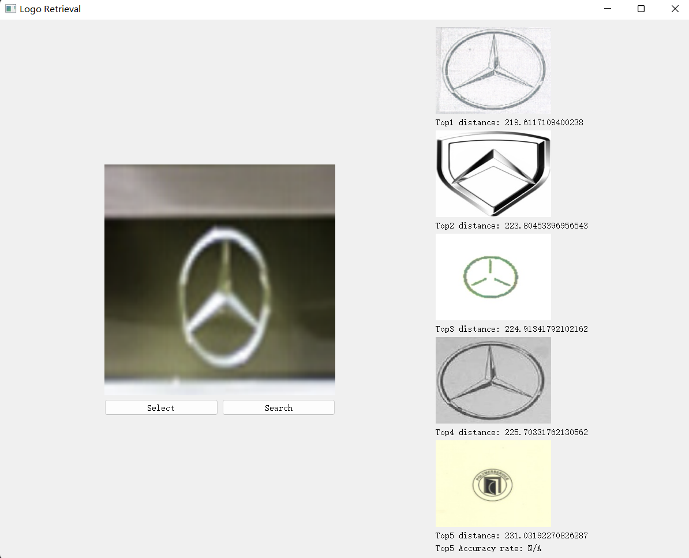

# Logo Retrieval

## Description
A logo retrieval tool for validating logos on a given picture. The input logo image will match 5 most similar logo images from the _real-logo_ dataset.

## Project Structure
For quick upload some directories are ignored. The whole structure is as follows:
```
├── main.py
├── README.md
├── demo/
├── logo_test/
│   ├── adidas1.png
│   ├── ...
├── images/
│   ├── xxx.jpg
│   ├── xxx.png
│   ├── ...
├── model/
│   ├── ResNet50V2Logos.h5
├── preprocessed
│   ├── img_paths_all.csv
│   ├── pred_data_all_rn50v2.csv
```

## Methods
- Extract low-level features of _logo images_ in `images/` folder using _ResNet50V2_ trained on [Logo2K+](https://github.com/Wangjing1551/Logo-2k-plus-Dataset) dataset. The output is an _array_ with dimension 2048.
- The output data of these images are stored in `preprocessed/pred_data_all_rn50v2.csv`, and the paths of these images are stored in `preprocessed/img_paths_all.csv`.
- The input image for retrieval is processed by __step 1__ as well, and its output array is compared with arrays in `preprocessed/pred_data_all_rn50v2.csv` using _KNN_ algorithm.
- The corresponding logo images of _5 nearest neighbours_ are the output.

## Instructions
Run `python3 main.py`, click __Select__ to choose an input image, click __Search__ to show the results.

## Demo
A sample input/output is as follows:



Note that the performance may drop due to light/background conditions.

A demo video can be found [here](/demo/Demo.mp4).
